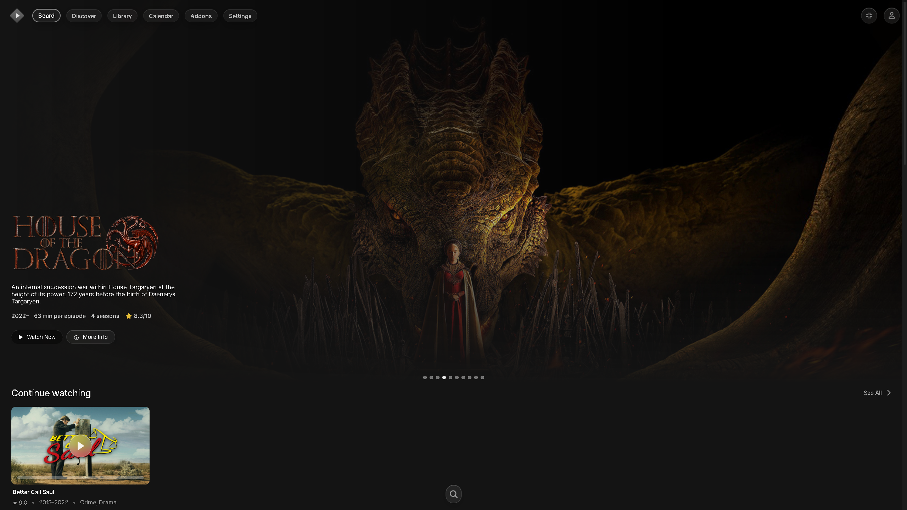
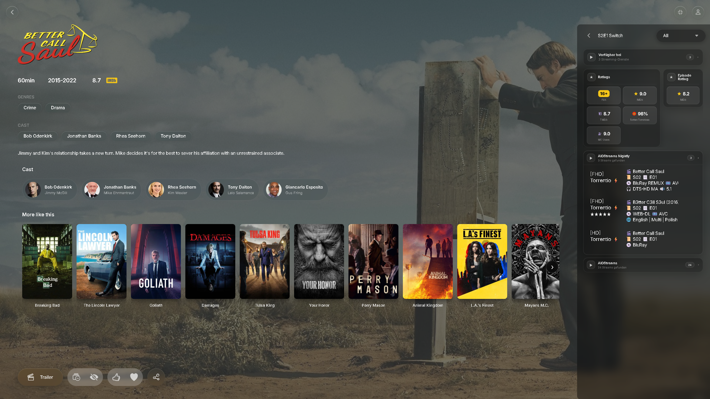
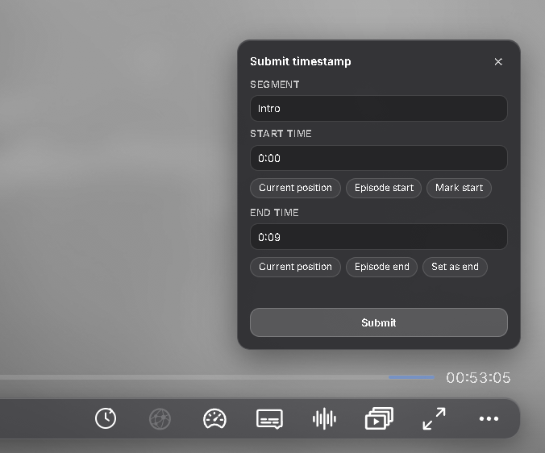
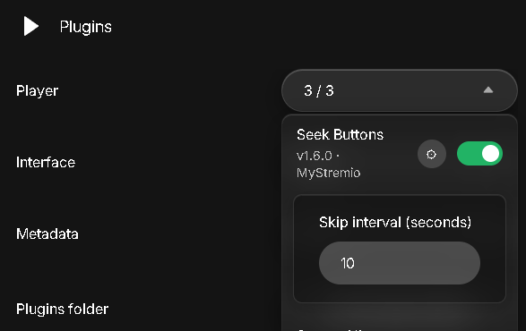
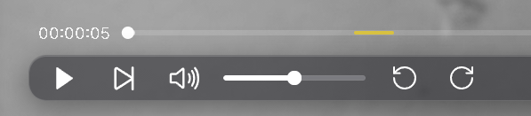

# MyStremio Spatial Audio Fork

[Visit the Official Repository: Cxsmo-ai/MyStremio-Spatial-audio-fork-](https://github.com/Cxsmo-ai/MyStremio-Spatial-audio-fork-)

> **Note:** This is a fork of the original [MyStremio by AlphiiJr](https://github.com/AlphiiJr/MyStremio). Huge thanks to the original creator for the incredible foundation!

**MyStremio** is a personalized Windows desktop client built on the Stremio shell stack.
It combines UI upgrades, player improvements, plugins/themes and library tools in one installer.
Current release: **2.2.9**

> **Disclaimer:** MyStremio is an independent community project and is not affiliated with official Stremio.
---

## 📌 Table of Contents

- [📌 Table of Contents](#-table-of-contents)
- [❤️ Support](#-support)
- [🚀 Features](#-features)
- [🛠️ Patch Notes](#️-patch-notes)
- [💾 Installation](#-installation)
  - [📂 Install paths](#-install-paths)
   - [📋 Requirements](#-requirements)
   - [🗑️ Uninstall](#️-uninstall)
   - [🎬 First-time setup](#-first-time-setup)
- [🎨 Themes and plugins (manual files)](#-themes-and-plugins-manual-files)
- [🧑‍💻 Build from source (developers)](#-build-from-source-developers)
- [🔒 Privacy and local data](#-privacy-and-local-data)
- [🙏 Credits](#-credits)
- [💬 Feedback](#-feedback)

---

### ❓ How MyStremio differs from official Stremio

-MyStremio uses MPV as the native video player

-Improved player tooling (hover timestamp, TheIntroDB/auto-skip options, controllable preload behavior, brightness control)

-Better stream organization and metadata presentation (enrichment panels and cleaner stream UI behavior)

-Integrated Cinebye management (manage addons, optional Cinemeta disable)

-Custom library groups with JSON import/export

-Additional power-user options such as plugin toggles and Discord Rich Presence

-Packaged as a ready-to-use single installer

---

### ❤️ Support

If you want to support my work you can leave a small tip on [ko-fi]( https://ko-fi.com/xalphiijr), I would really appreciate it! <3 

---

## 🏗️ Architecture

MyStremio is a heavily modified, high-performance fork of the standard Stremio desktop client that completely ditches the Electron framework. 

- **Rust-based WebView2 Shell (`stremio-shell-ng-main`)**: The core orchestrator. Manages the server, window, and native IPC integrations (like Discord Rich Presence).
- **MPV Omniphony Player (`mpv-x64`)**: Delegates all media decoding to a custom `mpv` build with advanced spatial audio capabilities (`orender` engine) instead of the standard WebPlayer.
- **Runtime JavaScript Injections (`assets/custom_*.js`)**: Instead of maintaining a bulky fork of the massive React codebase of Stremio Web, MyStremio uses a "monkey-patching" approach. It injects custom `.js` scripts into the WebView at runtime to forcefully add features (Liquid Glass, Smart Vibrance, Seek Buttons) directly into the UI.
- **Custom API (`custom_api/`)**: Overrides storage paths (saving to `%APPDATA%\mystremio`) to ensure isolated, stable user settings without conflicting with vanilla Stremio.

---

## 🚀 Features

### 🏠 Board hero home view

The board includes a hero section with rotating titles. The Theme is made by [Fxy6969/Stremio-Glass-Theme](https://github.com/Fxy6969/Stremio-Glass-Theme) and just slightly optimized by me.

   <p align="center">
  
</p>

### 🖱️ Hover metadata in catalogs

   While browsing catalogs, hover cards show key information (plot, genres, cast) without forcing a page change.
   <p align="center">
  
</p>


### 📖 Detail view with metadata and stream sidebar

The Data Enrichment Plugin by MrBlu03 (if TMDB API-Key is set) offers an enhanced detail page with cast and similar titles.
The StreamUI pluign offers a clean and modern sidebar with folders to pick streams from. (The plugin works for the follwing addons: Most torrent addons, [WatchHub](https://stremio-addons.net/addons/watchhub), [Ratings Aggregator](https://stremio-addons.net/addons/ratings-aggregator), [IMDb Ratings](https://stremio-addons.net/addons/imdb-ratings), [AfterCredits](https://aftercredits.almosteffective.com/configure.html)).

  <p align="center">
  
</p>

### 🎞️ Cinebye Addon Manager

[Cinebye](https://cinebye.elfhosted.com/) is integrated so you can manage addons inside Stremio and optionally disable specific sources (for example Cinemeta).

  <p align="center">
  
</p>

### 🌐 Favorite subtitle and audio languages

Inside player settings, you can define favorite subtitle and audio languages that act as your preferred language pool.
This preference layer is used by the quick language actions shown in the next section.

   <p align="center">
  
</p>
   

### ⚡ Quick Select language shortcuts

Quick Select reads your favorites and exposes them as one-click subtitle/audio buttons, so switching language is fast and consistent during playback.
In short: favorites define what is available, Quick Select is the runtime shortcut layer that applies those preferences immediately.

   <p align="center">
  
</p>

### ⚙️ Settings: themes and plugins

Themes and plugins can be managed directly from settings, including quick access to the themes/plugins folders.

   <p align="center">
  
</p>

### ⚙️ Settings: preload, library backup, Discord

Inside **Settings → MyStremio**, you get central controls for buffer/preload, library export/import, and Discord Rich Presence.

  <p align="center">
  
</p>

### ⏱️ TheIntroDB timestamp submission

Contribute segment timestamps to TheIntroDB while watching. Open the contribute panel from the player, mark times, pick the segment type, and submit — helps improve skip data for everyone.

  <p align="center">
  
</p>

### ⏩ Seek buttons

Configurable skip-back and skip-forward controls in the player bar — useful for quick rewinds or jumping ahead without scrubbing.

 <p align="center">
  
  
</p>

---
### 💡 Planned Features

- **IntroDB integration:** I plan on implementing both TheIntroDB and IntroDB together to get maximum coverage.
- **PiP:** I'm working on a picture in picture video mode
- **Seek Bar Thumbnail:** I want to add a thumbnail when hovering over the seek bar in the player.

---

## 🛠️ Patch Notes

### 2.2.9

- **Board hero banner (native React)** — Featured titles are rendered directly in the board route. This required shipping a **bundled local Web UI** instead of the public Stremio website, and moving **Settings → MyStremio** into native React (autoskip, favorite languages, plugin toggles, Discord, API keys) for a stable settings experience without DOM injection.
- **Hero loading** — Banner-area loading state instead of a Breaking Bad fallback flash; remaining fallback paths in the bundled Web UI were patched out.
- **Startup stability** — Cold-start guard for stale `#/player` routes, opaque fallback background, and safer player loading masks so the UI no longer goes black on the 2nd/3rd launch.
- **Dynamic Hero crash fix** — Null guards for missing hero titles (`year` / `preloadHeroImages`) so an empty hero cache no longer crashes React.
- **WebView2 cache handling** — Browsing cache is refreshed on version/Web UI changes without wiping the full profile; service worker registration is blocked in the desktop shell to avoid stale bundles.
- **Settings persistence** — Login, plugins, volume, autoskip, Discord, preload, language, library, and onboarding flags are restored from `%APPDATA%\MyStremio\mystremio-settings.json` before `main.js` loads, so restarts and updates no longer reset user configuration.
- **Stream buffering and player loading** — Reworked playback startup and buffering: configurable preload, and a more stable hand-off when a stream starts loading.
- **TheIntroDB timestamp submission** — Submit intro, outro, recap, and preview timestamps to [TheIntroDB](https://theintrodb.org/) from the player (mark start/end, pick segment type, submit with your API key).
- **Seek buttons** — Skip backward and forward from the player control bar with a configurable interval (Settings → MyStremio → Plugins).
- **In-app updater** — Checks GitHub Releases for `MyStremioSetup-v*_x64.exe`, verifies `SHA256SUMS.txt`, and installs updates via the existing Stremio update banner (still in testing).
- **Player brightness** — Brightness control in the left player bar with MPV tone adjustment, draggable slider, and compact popup UI.
- **Board scroll** — Fixed rubberbanding on the first scroll after app start; scroll position restore only runs when returning from detail/player within the same session.
- **Plugin and player adjustments** — Updates to stream UI, TheIntroDB skip logic, continue-watching covers, metadata hover panels, and data enrichment mount targeting.
- **Player shell assets** — Updated player loading overlay, glass-style controls, playback API integration, and seek-buffer handling.
- **Custom board scrollbar** — Always-visible scrollbar on the board and other main catalog views, alongside mouse-wheel scrolling.
- **Scroll behavior in panels and menus** — Plugin dropdown menu, metadata hover panels, and library context menus behavior fixed.
- **Navigation during tab switches** — The horizontal navigation bar stays in place while routes load, without jumping or briefly disappearing.
- **Meta Hover Panel** — Removed duplicated year display.
- **Plugin live updates** — Partially added live updates when plugins are toggled.
- **Artifacts** — Fixed artifacts appearing in the subtitle settings and shortcuts section.
- **StreamUI** — Added Usenet grouping to StreamUI plugin (still in testing). Fixed UI language.

---

### Known Issues

- **First stream playback:** On the first stream start after launching the app, the video may remain frozen on the first frame. One click into the seek bar fixes the issue.
- **Windows display scaling:** UI scaling issues may occur when Windows display scaling is set to anything other than **100%**.
- **Cast Search Addon:** The Cast Search Addon is not compatible with the StreamUI plugin as the cast members load the same way as video streams which messes with correct grouping.
- **Formatter:** Flags don't display correctly.

---

## 💾 Installation

1. Download the latest `MyStremioSetup` installer from this repository's **Releases** page: [Cxsmo-ai/MyStremio-Spatial-audio-fork-/releases](https://github.com/Cxsmo-ai/MyStremio-Spatial-audio-fork-/releases)
2. **Omniphony Studio (REQUIRED):** You MUST also download the Windows **Omniphony Studio Installer** from the official Omniphony releases page (make sure to grab the latest stable release, not a beta): [mgth/Omniphony/releases/latest](https://github.com/mgth/Omniphony/releases/latest)
   - **Why it's needed:** MyStremio completely replaces the default audio player with a custom spatial audio engine (`orender`). Omniphony Studio is the companion GUI required to actually control this engine. Without it, you cannot switch between spatial 7.1.4 and binaural headphone modes, and you cannot adjust crucial settings like your room size, unit scale, and master normalization volume.
3. Run `MyStremioSetup-v2.2.9_x64.exe` (or the latest version).
4. The installer sets up:
   - App binaries (`mystremio-shell.exe`, streaming server, FFmpeg, libmpv)
   - Bundled plugins and themes
   - Prebuilt local Web UI
   - WebView2 runtime (if missing)
   - Protocol handlers (`stremio://`, `magnet:`, optional `.torrent`)
5. Launch MyStremio from the Start menu or desktop shortcut.


### 📂 Install paths

- App: `%LOCALAPPDATA%\Programs\MyStremio\`
- User data (settings/addons): `%APPDATA%\MyStremio\`

### 📋 Requirements

- Windows 10/11 (64-bit)
- Internet connection (addons, metadata sources, streaming)
- Optional API keys for plugins (for example TMDB, TheIntroDB)

### 🗑️ Uninstall

Use **Windows Apps & Features** or the Start menu uninstaller.
Optionally delete `%APPDATA%\MyStremio\` to remove all local user data.

---

## 🎬 First-time setup

1. Install and launch MyStremio.
2. Sign in with your Stremio account.
3. Open **Settings → MyStremio** and configure optional items:
   - Preload/buffer
   - Themes/plugins
   - Discord Rich Presence
   - Plugin API keys (TheIntroDB for timestamp submission)
4. Create library folders and use JSON import/export when needed.

---

## 🎨 Themes and plugins (manual files)

1. Open **Settings → MyStremio**.
2. Click **Open themes/plugins folder**.
3. Place your theme/plugin files in that folder.
4. Toggle the switch and press CTRL+R to reload the app.

---

## 🧑‍💻 Build from source (developers)

Requires Rust (MSVC), Visual Studio Build Tools, Inno Setup 6, Node.js with pnpm (optional, for Web UI rebuild), and an installed Stremio Desktop runtime (for `libmpv-2.dll`).

```powershell
cd stremio-shell\stremio-shell-ng-main
.\package-release.ps1
```

Output: `release\MyStremioSetup-v2.2.9_x64.exe`

The repo includes a prebuilt `stremio-shell/stremio-shell-ng-main/webui/` bundle. To rebuild the Web UI from source, clone [stremio-web](https://github.com/Stremio/stremio-web) into `.tmp/stremio-web`, apply MyStremio patches, then run the build script again.

---
## 🔒 Privacy and local data

- No API keys or personal settings are prefilled in the installer.
- Settings, addon data, and library structure are stored locally in `%APPDATA%\MyStremio\`.
- Cinebye login uses your Stremio session at runtime — no credentials are stored in the repository.
- Discord Rich Presence only sends data when enabled and connected.

---

## 🙏 Credits

This fork is built upon the original [MyStremio by AlphiiJr](https://github.com/AlphiiJr/MyStremio).

MyStremio is based on the following independent community projects:

- [REVENGE977/stremio-enhanced](https://github.com/REVENGE977/stremio-enhanced)
- [Fxy6969/Stremio-Glass-Theme](https://github.com/Fxy6969/Stremio-Glass-Theme)
- [Bo0ii/StreamGo](https://github.com/Bo0ii/StreamGo)
- [TheIntroDB](https://theintrodb.org/)

These projects were important inspiration, and I used many of their features for my own custom build.

---

## 💬 Feedback

This started as a fun personal project and is improved iteratively.
If you find reproducible bugs or have ideas, please share feedback or open an issue.
