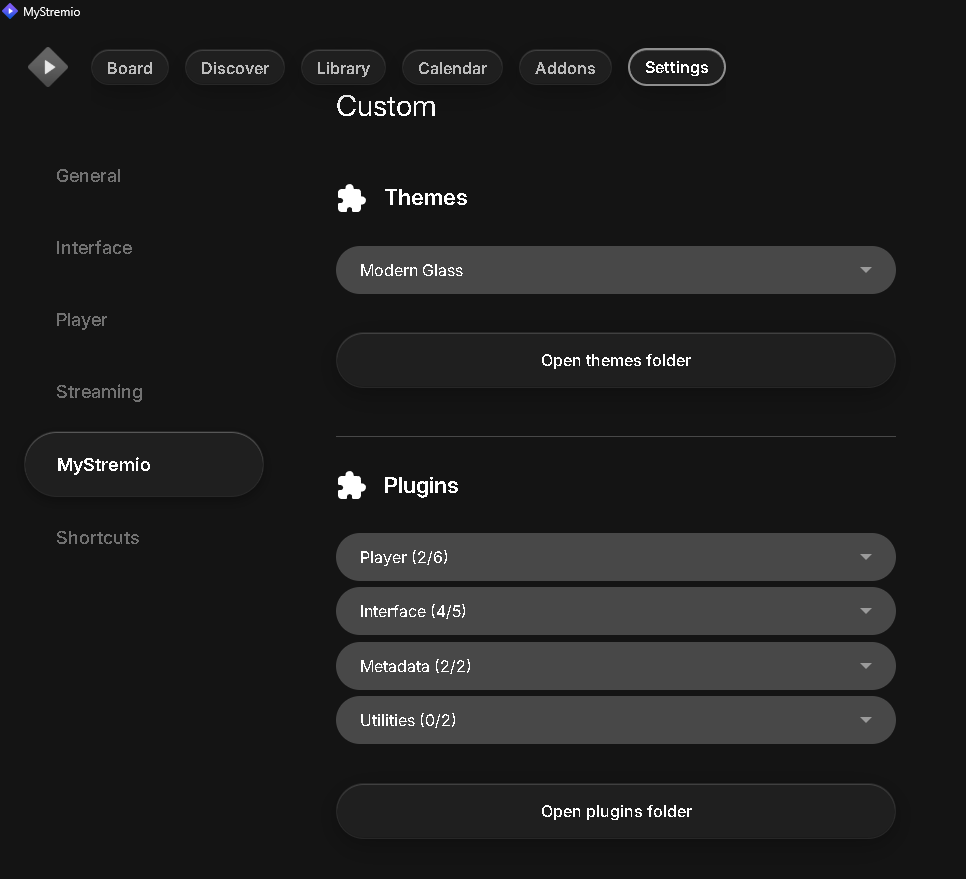

# MyStremio

**MyStremio** is a personalized Windows desktop client built on the Stremio shell stack.
It combines UI upgrades, player improvements, plugins/themes, library tools, and Discord Rich Presence in one installer.

> **Disclaimer:** MyStremio is an independent community project and is not affiliated with Stremio AG.

---

## How MyStremio differs from official Stremio

- Built-in UI and navigation enhancements (including a Glass-style look and a custom settings area)
- Improved player tooling (hover timestamp, TheIntroDB/auto-skip options, controllable preload behavior)
- Better stream organization and metadata presentation (enrichment panels and cleaner stream UI behavior)
- Integrated Cinebye management (manage addons, optional Cinemeta disable)
- Custom library groups with JSON import/export
- Additional power-user options such as plugin/theme toggles and Discord Rich Presence
- Packaged as a ready-to-use single installer

---

## Features with screenshots

### 1) Cinebye Addon Manager

Cinebye is integrated so you can manage addons in one place and optionally disable specific sources (for example Cinemeta).


### 2) Detail view with metadata and stream sidebar

The detail page combines metadata, cast, similar titles, and an extended stream/provider sidebar in one view.


### 3) Board hero home view

The board offers a modern hero section, quick actions, and direct access to Continue Watching.


### 4) Settings: preload, library backup, Discord

Inside **Settings -> MyStremio**, you get central controls for buffer/preload, library export/import, and Discord Rich Presence.


### 5) Settings: themes and plugins

Themes and plugins can be managed directly from settings, including quick access to the themes/plugins folders.



### 6) Hover metadata in catalogs

While browsing catalogs, hover cards show key information (plot, genres, cast) without forcing a page change.


---

## Installation

1. Download the latest installer from this repository's **Releases** page.
2. Run `MyStremioSetup-..._x64.exe`.
3. The installer sets up:
   - App binaries (`mystremio-shell.exe`, streaming server, FFmpeg, libmpv)
   - Bundled plugins and themes
   - WebView2 runtime (if missing)
   - Protocol handlers (`stremio://`, `magnet:`, optional `.torrent`)
4. Launch MyStremio from the Start menu or desktop shortcut.

### Install paths

- App: `%LOCALAPPDATA%\Programs\MyStremio\`
- User data (settings/addons): `%APPDATA%\MyStremio\`

### Requirements

- Windows 10/11 (64-bit)
- Internet connection (web UI, addons, metadata sources)
- Optional API keys for plugins (for example TMDB, TheIntroDB)

### Uninstall

Use **Windows Apps & Features** or the Start menu uninstaller.
Optionally delete `%APPDATA%\MyStremio\` to remove all local user data.

---

## First-time setup

1. Install and launch MyStremio.
2. Sign in with your Stremio account (or continue as guest).
3. Install your preferred addons.
4. Open **Settings -> MyStremio** and configure optional items:
   - Preload/buffer
   - Themes/plugins
   - Discord Rich Presence
   - Plugin API keys
5. Create library folders and use JSON import/export when needed.

---

## Themes and plugins (manual files)

### Install a theme

1. Open **Settings -> MyStremio**.
2. Click **Open themes folder**.
3. Place your theme files in that folder.
4. Restart the app and select the theme.

### Install a plugin

1. Open **Settings -> MyStremio**.
2. Click **Open plugins folder**.
3. Place your plugin files in that folder.
4. Restart (or reload) the app, then enable the plugin.

---

## Build from source (developers)

Requires Rust (MSVC), Visual Studio Build Tools, Inno Setup 6, and an installed Stremio Desktop runtime.

```powershell
cd stremio-shell\stremio-shell-ng-main
.\package-release.ps1
```

Output: `release\MyStremioSetup-..._x64.exe`

Optional for a clean GitHub-ready package:

```powershell
.\publish-github.ps1
```

---

## Privacy and local data

- No API keys or personal settings are prefilled in the installer.
- Settings, addon data, and library structure are stored locally in `%APPDATA%\MyStremio\`.
- Discord Rich Presence only sends data when enabled and connected.

---

## Credits

MyStremio is heavily inspired by:

- [REVENGE977/stremio-enhanced](https://github.com/REVENGE977/stremio-enhanced)
- [Bo0ii/StreamGo](https://github.com/Bo0ii/StreamGo)

Both projects were important inspiration, while MyStremio is implemented and packaged as its own custom build.

---

## Feedback

This started as a fun personal project and is improved iteratively.
If you find reproducible bugs or have ideas, please share feedback or open an issue.
